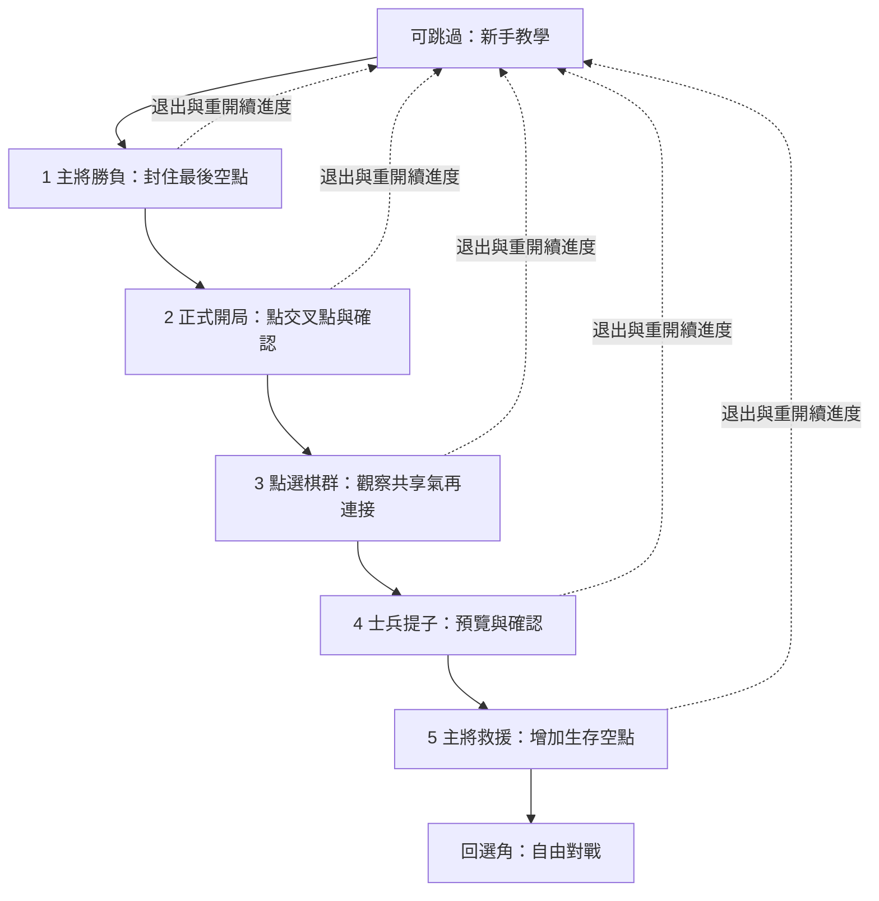

# ONBOARD-01：零圍棋基礎的新手體驗

定位：「不需要懂圍棋，也能在 5 分鐘內開始玩的奇幻戰術桌遊。」約五分鐘為設計目標，尚無真人測時。保留策略及正式規則，透過操作學規則；本轮只做 TUT-0、TUT-1，不提前開 TUT-2～4。

## TUT-0 合約（L2 狀態完整性）

- 所有操作仍用 TacticalGoCore.GameSession.apply；預覽用 GameEngine.apply 的不可變結果。UI 查氣與棋群只調 Core.Board.group／liberties。
- 五個基礎 Fixture 只使用原版、沒有英雄或候選設定。第一關使用即將提主將的固定合法局面，以一次真實勝利建立目標；第二關正式開局展示首回合特例；第三～五關固定合法局面，各棋群初始有氣。固定局面明標教學，不宣稱是 Owner 存局或敵人自然走出來的棋形。
- 不教眼、定石、地盤或圍棋傳統勝負。英雄／能量技能留 TUT-2，候選技能不进入本輪教學。
- 進度另存 Onboarding/onboard-v1.json；與 Matches 存局完全分離。只保存教學版本／關卡索引／已提交落子／已觀察棋群點，重開以 Core 重播驗證；不保存任意盤面，不静默覆寫坏进度。
- 非法操作不扣資源，取消清除預覽，復原同步教學動作／Ko與完成狀態；背景保存已提交進度並清除暫態。完成一關即停止盤面操作，先展示結果，再由玩家選下一步。
- 不啟用 AI 教學對手，不新增戰術提示最佳落點、三段提示設定、選角技能教學或動態美術。保留既有音效設定／減少動態；本輪以靜態結果文字也可完成。

## 五步流程及完整文案

每關小目標、操作提示及成功解釋放在 Fixtures/onboard-v1.json，同一資源用于 UI 与測試。推薦交叉點高亮只是教學引導；其他選取及非法落子均經 Core，沒有假提子。第三關先看棋群，再做落子，避免只背下定義。

| 關卡 | 推薦操作 | 獨立預期 | 教什麼 |
|---|---|---|---|
| 主將勝負 | 黑方 D3 | 提白主將 D2，黑方勝；黑主將仍在 D6 | 主將被提决定勝負 |
| 放下一顆 | 正式7×7開局黑方 C6 | 黑方首回合1AP→白方2AP，不扣能量 | 放在交叉點／確認才落子／回合 |
| 讓棋子呼吸 | 先選 C4 或 D4，再放 E4 | 原二子共享6氣；連第三子後8氣 | 上下左右、相連共享、不是斜角 |
| 包圍敵兵 | 黑方 D4 | 提白兵 D3一顆、無勝負 | 棋群沒有氣即提走 |
| 拯救主將 | 黑方 D4 | 黑主將串1氣→3氣，主將保留 | 警示原因與合法解圍 |

關卡完成按 Domain 結果／事件和已觀察棋群判定，不按點擊位置冒充成功。第三關可接受其他使原群增加棋子且不減少氣的合法連接，不只接受推薦點。

## 驗證與 Gate

自動：Fixture 初始棋群氣、手算單子／棋群／角落／邊界；成功與失敗／取消／復原的資源與事件；預覽等於結算；主將勝負與危險；第三關合法替代；進度完整重播／壞資料／版本隔離／正式存局位元組保留。原版 Golden 回歸。原生 SE／iPad 完成五步、點擊座標與氣的疊層、退出重開／復原與小螢幕控制可用，錄影與截圖另存。

TUT-0 規格／Fixture／事件合約與 TUT-1 基礎可玩交付各自驗證。TUT-2 普通技能與AP／Mana完整教學、TUT-3 對局提示選項、TUT-4 真機及至少5位無圍棋經驗玩家尚未啟動／通過。首輪真人目標4/5独立完成落子與氣、提子、主將勝負、進入首局；只給遊戲內教學，不口頭補課，記卡點、誤解、重複提示與時間。樣本不代表市場通過率。

交付在 codex/onboard-01；不合併／發布，不接 B1 素材，不改平衡／勝負／候選規則。工程 PASS 不等於五分鐘理解或完整 ONBOARD-01 產品 PASS。
